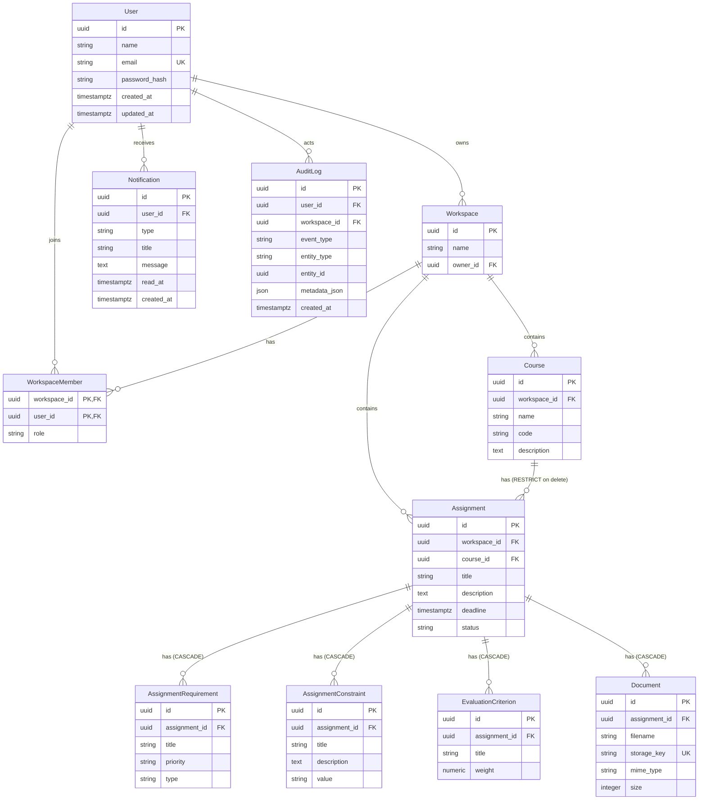

# Architecture

## Shape

StudyOS is a modular monolith: one FastAPI service and one Next.js application, plus
PostgreSQL and a filesystem volume. The backend is organized by domain module, not by technical
layer, so a feature can be read end to end in one directory.

```text
apps/api/app
  core/         settings, security, errors, logging, dependencies
  db/           engine, session, declarative base
  models/       SQLAlchemy entities and enums
  schemas/      Pydantic request and response contracts
  modules/      auth, courses, assignments, documents, dashboard, notifications
  storage/      StorageService abstraction and local implementation
  services/     cross-module helpers (audit, file validation, events)
  scripts/      operational scripts such as the demo seed
```

Deviations from the originally suggested layout, and why, are recorded in
[decisions/0004-repository-layout.md](decisions/0004-repository-layout.md).

## Domain model



Every course, assignment, and document belongs to a workspace. Nested records (requirements,
constraints, criteria, documents) inherit tenancy from their assignment.

Deletion behaviour is deliberate and asymmetric: nested specification records cascade with their
assignment, but a course with assignments is rejected (`RESTRICT`) rather than silently taking the
student's work with it. Audit rows are detached, not deleted, when their user or workspace is
removed.

## Tenancy enforcement

A session cookie carries a signed JWT with the user ID. The dependency layer resolves the caller's
workspace from their memberships, and every handler filters queries by `workspace_id`. Resources are
loaded through ownership helpers, so an ID from another workspace returns 404 rather than leaking
existence. Multi-workspace selection is deliberately out of scope, but the dependency is the single
seam where it would be introduced.

Registration creates the user, a workspace, and an owner membership in one transaction, so a new
account is immediately usable.

## Data integrity rules

- Course codes are unique per workspace (`uq_courses_workspace_code`).
- Criterion weights are stored as `NUMERIC(5,2)` and summed server side with `Decimal`. Weights and
  `criteria_total` are serialized as **strings** (`"25.50"`, `"100.00"`) so no binary float rounding can
  make a balanced 100 look wrong. More than two decimal places is a 422
  (`INVALID_WEIGHT_PRECISION`) rather than a silent rounding.
- Requirement codes come from a per-assignment high-water sequence allocated in the same transaction as
  the insert, so two concurrent creates cannot be handed the same number (409
  `REQUIREMENT_SEQUENCE_CONFLICT`). Numbers are never reused after a delete, which keeps an old
  `REQ-002` unambiguously referring to the same work in the audit trail.
- Readiness is derived, never trusted. A blocking check failing demotes a ready assignment to
  `INCOMPLETE`; promoting back to `READY_FOR_ANALYSIS` always requires an explicit request, so a silent
  background edit can never hand a student a green light they did not confirm.
- Dependencies may not form cycles, and self-dependency is rejected; the graph read reports `has_cycles`
  rather than failing outright so a bad link can still be inspected and repaired.
- Deleting a course that still has assignments is rejected rather than cascading.
- Timestamps are stored as timezone-aware UTC. The frontend converts to and from `datetime-local`
  strings so students always see their own local time.

## Documents

Uploads go through `StorageService`, which today resolves to `LocalStorage`. The service interface
takes an assignment ID and a safe filename and returns a generated key; the API stores only the key,
never a user-supplied path. Downloads are streamed through an authenticated endpoint, and
`Content-Disposition` is always attachment-style so assignment documents cannot execute in the app
origin. Swapping in S3 or another backend means implementing the same interface.

## Frontend

The web app uses the Next.js App Router. The server shells render layout and static content; data
fetching happens in client components through a single typed API client that always sends
credentials. Authentication state is held in one provider that revalidates the session on load and on
route changes.

Two details worth knowing:

- `NEXT_PUBLIC_API_URL` is inlined at build time, so the Docker build receives it as a build argument.
- Submit buttons stay disabled until hydration completes. Without that, a click on a not-yet-hydrated
  button triggers a native form GET, which would put typed values, including passwords, into the URL.

## Observability and errors

Every request receives a request ID, which is returned in the `X-Request-ID` header and included in
structured JSON logs alongside method, path, status, and duration. Domain errors are raised as
`AppError` and rendered as a consistent envelope:

```json
{
  "error": {
    "code": "CRITERIA_TOTAL_INVALID",
    "message": "Evaluation criteria must total exactly 100% before marking an assignment ready.",
    "details": { "total": "80.00" }
  }
}
```

Validation failures use `VALIDATION_ERROR`, uniqueness violations surface as 409 `CONFLICT`, and
unexpected database problems return 503 `DATABASE_UNAVAILABLE` instead of leaking internals.

`/health` is a liveness check, `/ready` verifies database connectivity.

## Deployment topology

```text
browser ──> web (Next.js, port 3000) ──> api (FastAPI, port 8000) ──> postgres (5432)
                                              │
                                              └──> upload volume
```

Compose orders startup with health checks: the API waits for PostgreSQL, the web app waits for the
API, and the API runs `alembic upgrade head` before serving. Data lives in two named volumes, so
`docker compose down` preserves state and `docker compose down -v` resets it.

## Future phases

There is deliberately no AI code yet. The seams a later engine plugs into are already in place: domain
modules own their write paths, `services/audit.py` records state changes, `StorageService` isolates file
IO, and `Notification` plus `AuditEventType` define the vocabulary an engine can publish. The
specification model is the important one here: because a `READY_FOR_ANALYSIS` assignment already carries
validated requirements, constraints, weighted criteria, deliverables, and technologies, a future engine
consumes a checked artifact instead of parsing free text. How that engine is expected to attach is
described in [future-ai.md](future-ai.md).

## Decisions

Architecture decision records live next to this file:

- [0001 Cookie-based session authentication](decisions/0001-cookie-session-auth.md)
- [0002 Storage service abstraction](decisions/0002-storage-abstraction.md)
- [0003 Workspace tenancy and ownership checks](decisions/0003-workspace-tenancy.md)
- [0004 Repository layout](decisions/0004-repository-layout.md)
- [0005 Local development database](decisions/0005-local-development-database.md)
